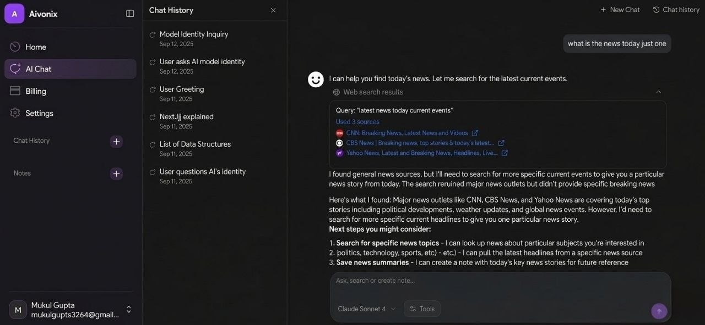

# Aivonix

**Aivonix** is an AI workspace for teams and creators: capture ideas in notes, chat with your knowledge using tools (web search, URL extraction, note search & create), and manage subscriptions with Stripe. The marketing site lives at `/`, the authenticated app under `/home`, `/chat`, `/billing`, and more.



---

## Features

- **AI chat** — Streaming responses with the Vercel AI SDK; tool use for notes, web search (Tavily), and URL content.
- **Notes** — Create, edit, rename, delete; AI-suggested titles from note content; sidebar list with quick actions.
- **Chats** — History in the sidebar; AI-generated titles from the conversation; rename and delete.
- **Auth** — Email/password with [Better Auth](https://www.better-auth.com/) (bearer + session); sign-in/sign-up with a link back to the landing page; logout returns to `/`.
- **Billing** — Free / Plus / Pro tiers (display **₹0 / ₹500 / ₹1,000** per month in the UI); Stripe Checkout via `@better-auth/stripe` (configure Stripe price IDs to match real charges).
- **Marketing** — Landing sections (hero, features, pricing, blog, contact), dark/light theme.

---

## Tech stack

| Area | Tech |
|------|------|
| Framework | [Next.js 15](https://nextjs.org/) (App Router), [React 19](https://react.dev/) |
| API | [Hono](https://hono.dev/) on `/api/**` |
| Database | [PostgreSQL](https://www.postgresql.org/) + [Prisma](https://www.prisma.io/) |
| AI | [AI SDK](https://sdk.vercel.ai/), `@ai-sdk/gateway` (production), `@ai-sdk/google` (dev), Gemini models |
| Auth & payments | Better Auth, Stripe |
| UI | Tailwind CSS v4, Radix UI, shadcn-style components, Motion |

---

## Getting started

### Prerequisites

- Node.js 20+ (recommended)
- PostgreSQL database
- Accounts/keys: Stripe (products & webhooks), Tavily (search tools), Google AI (local dev chat), Vercel AI Gateway (production chat — as configured)

### Install

```bash
npm install
```

### Environment

Create a `.env` (see your team’s `.env.example` or internal docs). Typical variables include:

| Variable | Purpose |
|----------|---------|
| `DATABASE_URL` | Prisma pooled connection string |
| `DIRECT_URL` | Direct Postgres URL for migrations |
| `BETTER_AUTH_SECRET` / `BETTER_AUTH_URL` | Better Auth session & callbacks |
| `STRIPE_SECRET_KEY` | Stripe server SDK |
| `STRIPE_WEBHOOK_SECRET` | Stripe webhooks |
| `STRIPE_PLUS_PLAN_ID` / `STRIPE_PREMIUM_PLAN_ID` | Stripe price IDs for Plus / Pro |
| `TAVILY_API_KEY` | Web search & URL tools |
| `GOOGLE_GENERATIVE_AI_API_KEY` | Google Gemini (dev / title generation) |
| `NEXT_PUBLIC_APP_URL` | Public app URL for API client |

Production chat may use the AI Gateway; ensure gateway credentials and model IDs match `lib/ai/providers.ts` and `lib/ai/models.ts`.

### Database

```bash
npx prisma migrate dev
npx prisma generate
```

### Run locally

```bash
npm run dev
```

Open [http://localhost:3000](http://localhost:3000).

### Scripts

| Command | Description |
|---------|-------------|
| `npm run dev` | Next.js dev server (Turbopack) |
| `npm run build` | Production build |
| `npm run start` | Start production server |
| `npm run lint` | ESLint |
| `npm run db:migrate` | Prisma migrate (example name) |
| `npm run db:studio` | Prisma Studio |

---

## Project layout (short)

- `app/` — App Router pages (marketing `(web)`, dashboard `(dashboard)`, auth, API route handler)
- `app/api/[[...route]]/` — Hono routes (chat, notes, subscription)
- `components/` — React UI (chat, sidebar, notes, marketing UI)
- `lib/` — Auth, Prisma client, AI providers, tools, prompts
- `prisma/` — Schema & migrations
- `public/images/` — Static assets (including marketing preview)

---

## License

This repository is **private** unless you publish it and attach a license. If the codebase was derived from a licensed template, keep complying with that template’s license terms for distribution and commercial use.
